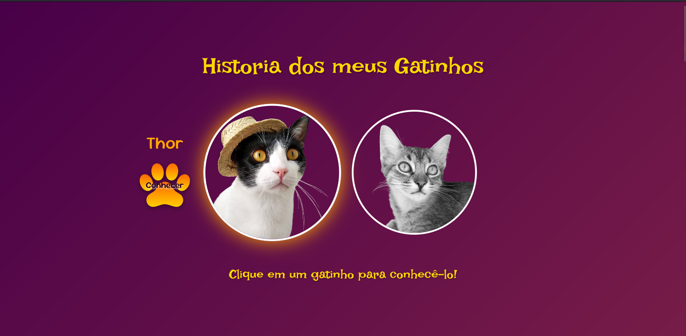

# Historia Dos Meus Gatos 🐾


> Um site feito com muito carinho para contar a história dos meus dois gatos, Thor e Luna.

### ✨ [Veja o site ao vivo aqui!](https://anaflgg.github.io/historia_dos_meus_gatos/) 
---

### 📸 Screenshot

 

---

### 📖 Descrição do Projeto

Este é um projeto pessoal criado para apresentar meus dois gatos, Thor e Luna. A ideia era criar uma página única e interativa que contasse um pouco da história de cada um, suas personalidades e o significado de seus nomes, celebrando o amor que tenho por eles. Usei este projeto também para praticar e aprimorar minhas habilidades em desenvolvimento front-end.

---

### 🚀 Tecnologias Utilizadas

O projeto foi construído utilizando as seguintes tecnologias:

* **HTML5:** Para a estrutura e semântica do conteúdo.
* **CSS3:** Para estilização, animações e design responsivo.
* **JavaScript:** Para a interatividade, como os efeitos de clique e os cards que viram.
* **Bootstrap 5:** Framework utilizado para agilizar a criação do layout responsivo e componentes como modais e carrosséis.
* **AOS (Animate On Scroll):** Biblioteca para criar as animações de surgimento dos elementos na rolagem da página.

---

### 🎯 Funcionalidades

* **Apresentação Interativa:** Efeito de hover/clique nos gatos na página inicial.
* **Histórias Detalhadas:** Seções dedicadas para cada gato com efeito de "flip card" para mostrar suas personalidades.
* **Galerias de Fotos:** Carrosséis de imagens dentro de modais para ver mais fotos de cada um.
* **Player de Vídeo:** Modal com vídeo dos dois juntos.
* **Design Responsivo:** O site se adapta para uma boa visualização em desktops, tablets e celulares.

---

### 👷 Como Rodar o Projeto Localmente

Não há necessidade de instalação de dependências. Basta seguir os passos:

1.  Clone este repositório:
    ```bash
    git clone [https://github.com/anaflgg/historia_dos_meus_gatos.git](https://github.com/anaflgg/historia_dos_meus_gatos.git)
    ```
2.  Abra o arquivo `index.html` no seu navegador de preferência.

---

### 👨‍💻 Autor

Feito com muito amor (e muitos pelos) por **Ana Ananias**.

[](https://www.linkedin.com/in/ana-flávia-ananias-70088424a/)
[](https://github.com/anaflgg)